# DAFTAR TUGAS

<table border="2" cellpading="10">
  <tr>
    <td><b>Pertemuan 4</b></td>
    <td>Latihan VCS</td>
    <td><a href="https://github.com/IlhamLamp/LatihanVCS">Klik disini</td>
  </tr>
  <tr>
    <td><b>Pertemuan 5</b></td>
    <td>Program Biodata</td>
    <td><a href="https://github.com/IlhamLamp/Program-menginputkan-biodata">Klik disini</td>
  </tr>
  <tr>
    <td><b>Pertemuan 6</b></td>
    <td>Lab1 dan 2</td>
    <td><a href="https://github.com/IlhamLamp/ProjectPraktikum">Klik disini</td>
  </tr>
  <tr>
    <td><b>Pertemuan 7</b></td>
    <td>Lab3</td>
    <td><a href="https://github.com/IlhamLamp/Lab3">Klik disini</td>
  </tr>
  <tr>
    <td></td>
    <td>Labspy02</td>
    <td><a href="https://github.com/IlhamLamp/labspy02">Klik disini</td>
  </tr>
  <tr>
    <td></td>
    <td>Labpy03</td>
    <td><a href="https://github.com/IlhamLamp/labpy03">Klik disini</td>
  </tr>

</table>


# PENGGUNAAN GIT

## Pengertian Git
* Git adalah salah satu sistem pengontrol versi(Version Control System) pada proyek perangkat lunak yang diciptakan oleh Linus Torvalds.
* Fungsi utama git yaitu mengatur versi dari source code program, dengan memberi tanda baris dan code mana yang ditambah atau diganti.
* Git juga dikenal dengan distributed revision control (VCS terdistribusi), artinya penyimpanan database Git tidak hanya berada dalam satu tempat saja.

## Instalasi Git
* Download **Git** di website resminya [git-scm.com](https://git-scm.com).
* Kemudian unduh Git sesuai dengan arsitektur komputer kita. Apakah 64 bit atau 32 bit.
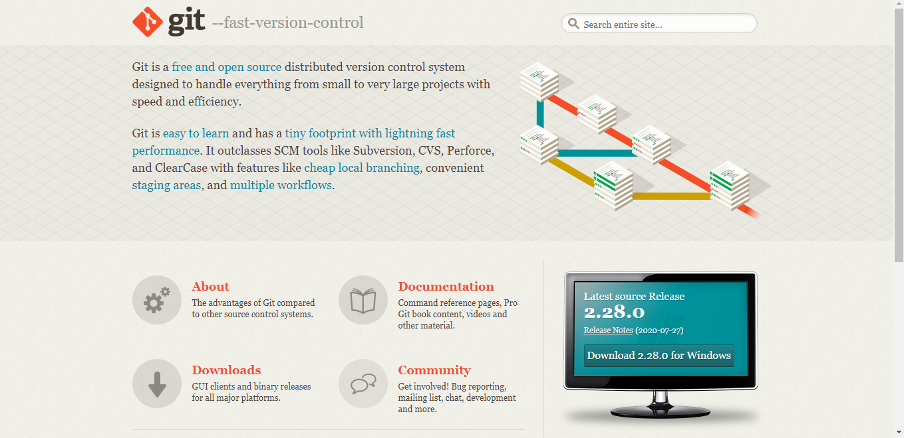
* Untuk pengguna Linux ``sudo apt-get install git`` & untuk Mac ``brew install git``

* Jika Git sudah terpasang, untuk mencobanya silahkan buka **Terminal** atau **CMD**, kemudian ketik perintah ``git --version.``

  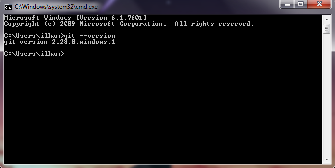


## Menambahkan Global Config
* Pada saat pertama kali menggunakan git, perlu dilakukan konfigurasi
user.name dan user.email agar tidak terjadi kegagalan saat menjalankan perintah ```git commit```
* konfigurasi ini bisa dilakukan untuk global repository atau individual
repository.
* Untuk Config Global Repository adalah

  ``$ git config --global user.name "nama_user"``

  ``$ git config --global user.email "email_user"``

  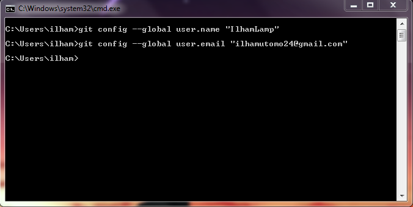

* Hasilnya dapat kita lihat dengan mengetik ``$ git config --list``

  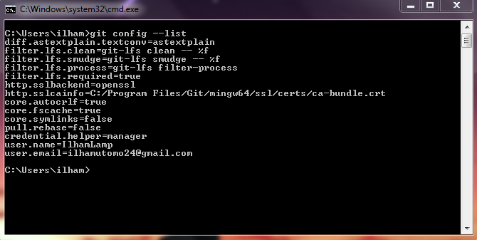


## Membuat Repositori Lokal
* Buka **Terminal** atau **CMD**, disini saya menggunakan **CMD**.
* Buat direktori baru dengan nama belajargit

  ``$ mkdir belajargit``

* Sehingga terbentuk satu direktori baru dibawahnya, selanjutnya masuk kedalam direktori tersebut dengan perintah cd (change directory)

  ``$ cd belajargit``

* direktori aktif menjadi: ``C:\Users\Ilham\belajargit>``

  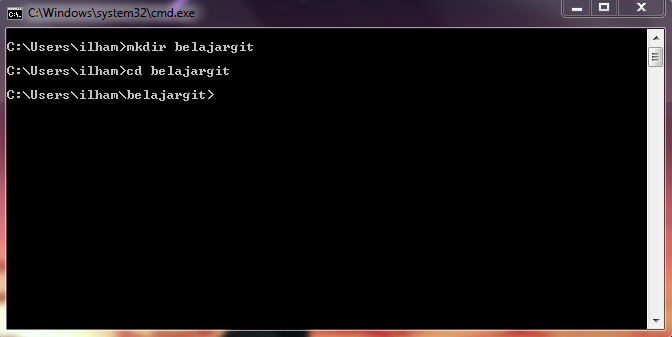

* Jalankan perintah git init, untuk membuat repositori lokal.

  ``$ git init``

  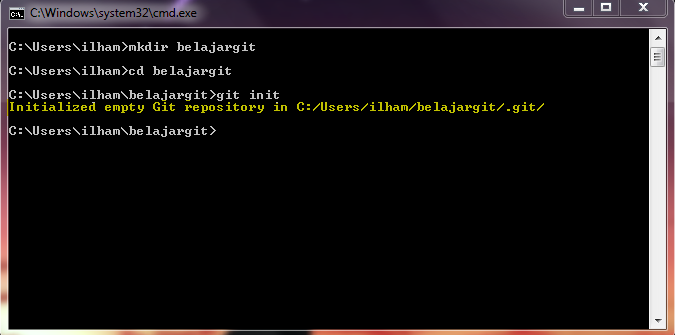
* Repository baru berhasil di inisialisasi, dengan terbentuknya satu direktori hidden dengan nama .git (perhatikan tulisan yang berwarna kuning).
* Pada direktori tersebut, semua perubahan pada working directory akan disimpan.


## Membuat File baru pada repositori
* Untuk membuat file dapat menggunakan text editor apa saja, lalu menyimpan filenya pada direktori aktif (repository).
* disini kita coba membuat satu file bernama README.md

  ``$ echo “Ini adalah file pertamaku” >> README.md``

  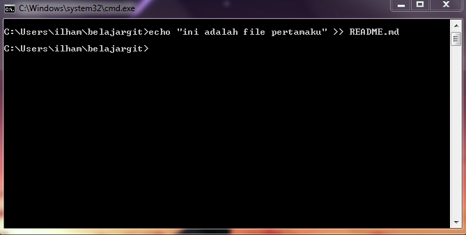

* File README.md berhasil dibuat. Untuk mengeceknya, pengguna Windows dapat mengetik ``dir``, sedangkan pengguna Linux cukup mengetik ``ls``

  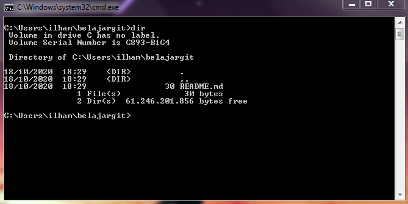


## Menambahkan File baru pada repositori
* Untuk menambahkan file yang sebelumnya baru saja dibuat, gunakan perintah git add.

  ``$ git add README.md``

* File README.md berhasil ditambahkan.
* Untuk mengeceknya bisa menggunakan ``git status``, maka tulisan berubah menjadi warna hijau.
  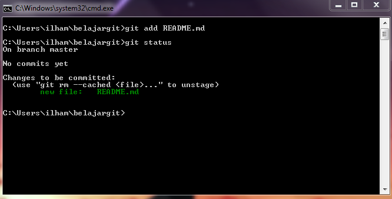


## Menyimpan perubahan ke database
* Untuk menyimpan perubahan yang ada kedalam database repositori lokal, gunakan perintah

  ``$ git commit -m 'Commit Pertama'``

* Perubahan berhasil disimpan.
* Cek kembali menggunakan ``git status``, maka output akan menampilkan "Nothing to commit .."

  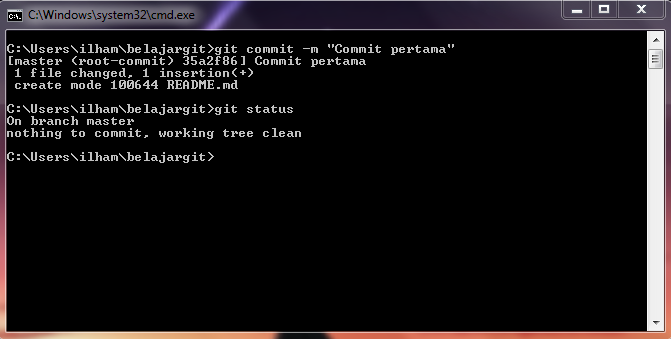


## Melihat catatan log
* Gunakan perintah ``git log`` untuk melihat perubahan catatan log pada repositori.

  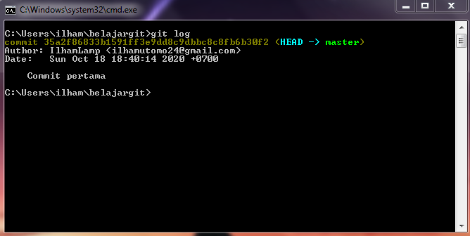


## Membuat repositori server
* Server repositori yang akan kita gunakan adalah https://github.com, sebelum itu kita harus membuat akun terlebih dahulu.
* Pada halaman github, klik tombol start a project, atau
* Dari menu (icon +) klik New Repository.

  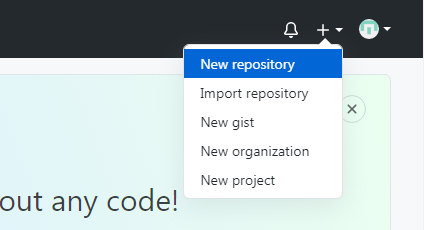


## Membuat repositori server
* Isi nama repository nya, misalnya: Repo-Pertamaku
* lalu klik tombol Create repository

  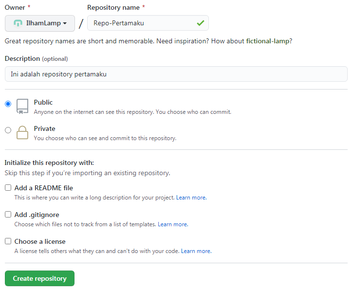


## Menambahkan Remote Repositori
* Remote Repository merupakan repositori server yang akan digunakan untuk menyimpan setiap perubahan pada repositori lokal, sehingga dapat diakses oleh banyak pengguna.
* Untuk menambahkan remote repository server, gunakan perintah

  ``$ git remote add origin https://github.com/IlhamLamp/Repo-Pertamaku.git``

  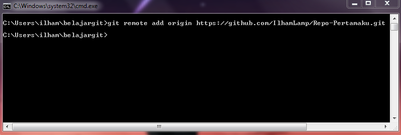


## Mengirim perubahan ke server
* Untuk mengirim perubahan pada repositori lokal ke server gunakan perintah git push.

  ``$ git push -u origin master``

* Perintah ini akan meminta memasukkan username dan password pada akun github.com

  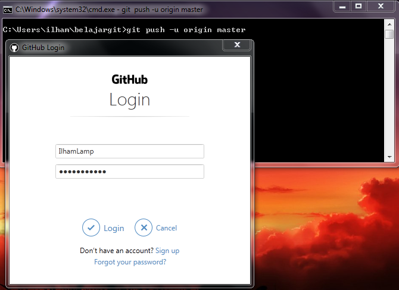

* (Setelah memasukkan username dan password)

  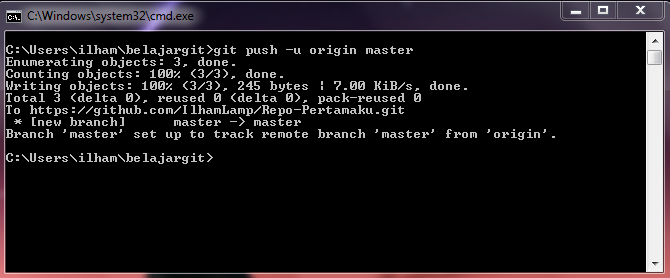


## Melihat hasilnya pada server repository
* Buka laman github.com, arahkan ke **Repo-Pertamaku**.
* Maka perubahan akan terjadi pada halaman tersebut.

  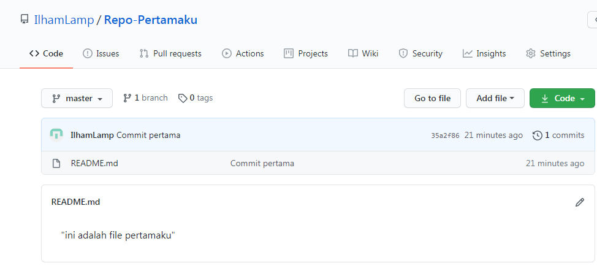


## Clone Repository
* Clone repository, pada dasarnya adalah meng-copy repository server dan secara otomatis membuat satu direktori sesuai dengan nama repositorinya.
* Untuk melakukan cloning, klik **Code**, maka akan muncul

  ``https://github.com/IlhamLamp/Repo-Pertamaku.git``

  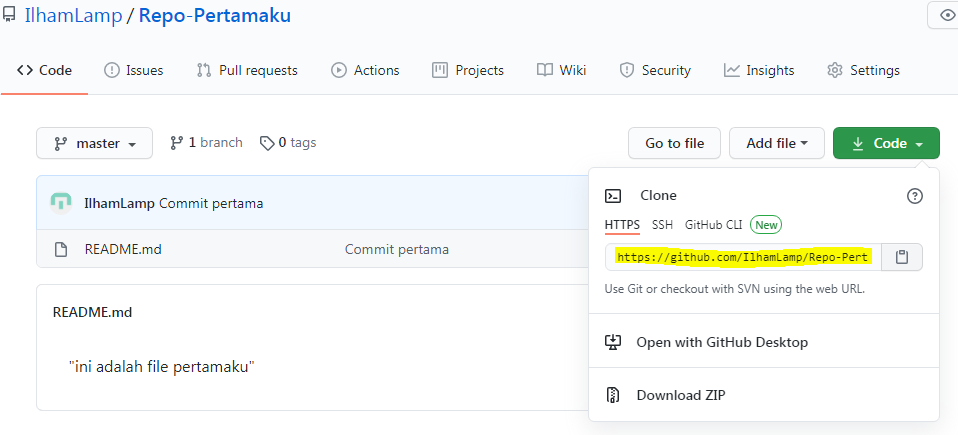

* Buka **Terminal** atau **CMD** lalu ketik

  `` git clone https://github.com/IlhamLamp/Repo-Pertamaku.git"``

  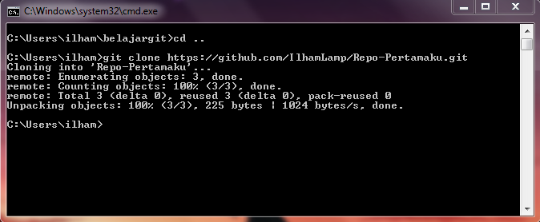

* Ketik ``dir`` pada windows dan ``ls`` pada linux untuk melihat hasilnya.

  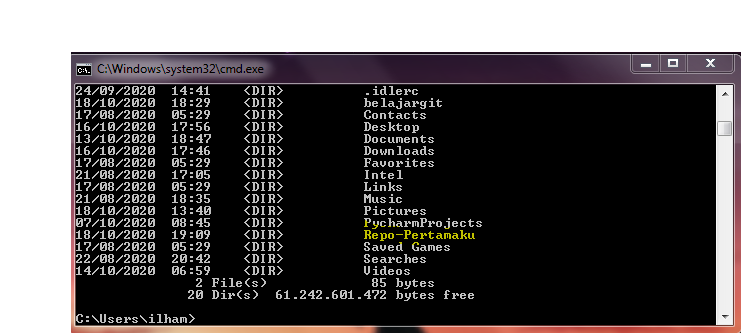

* Maka repositori telah berhasil di salin ke komputer kita.
